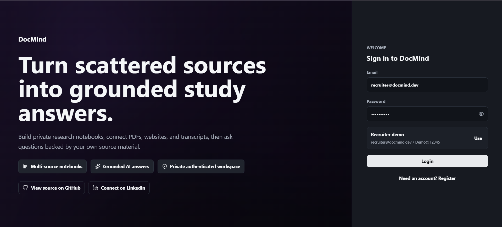
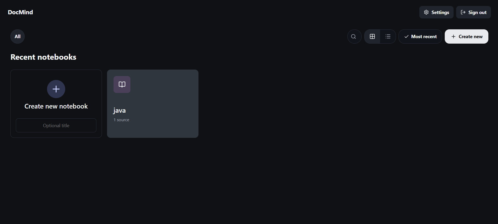
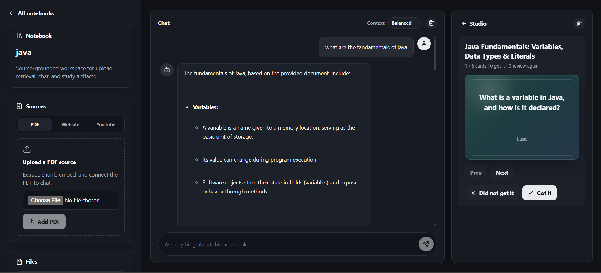
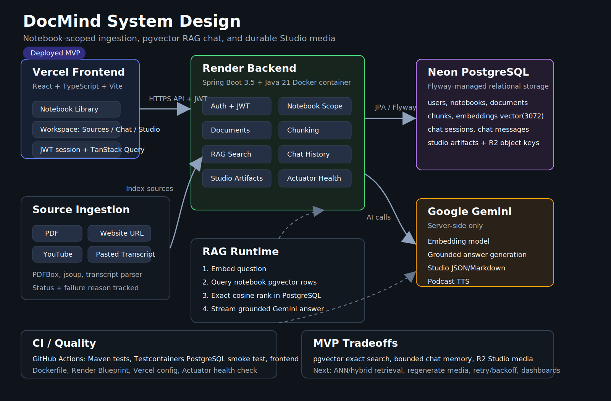

# DocMind

DocMind is a full-stack AI document intelligence workspace for uploading sources, chatting with notebook-scoped context, and generating study artifacts such as flashcards, quizzes, briefings, podcast audio, and infographic images.

Live app:

```text
https://docmind-omega-woad.vercel.app/
```

Backend health:

```text
https://docmind-2fa9.onrender.com/actuator/health
```

## Demo

Demo video:

```text
Coming soon
```

Landing and recruiter login:



Notebook library:



Notebook workspace with source-grounded chat and Studio flashcards:



## Highlights

- Notebook-scoped source ingestion for PDFs, websites, YouTube transcripts, and pasted transcripts.
- Text extraction, chunking, Gemini embeddings, and PostgreSQL-backed persistence.
- Notebook-scoped semantic retrieval with cosine similarity.
- Grounded chat answers with persisted notebook chat history.
- Studio mini apps for flashcards, quiz, briefing, podcast audio/script, and infographic image generation.
- JWT authentication, profile settings, notebook/source management, and responsive dark/light UI.
- Local Docker PostgreSQL, Spring Boot Actuator health/custom AI metrics, GitHub Actions CI, Testcontainers, and deployment configs for Render/Vercel.

## System Design

Documentation map:

```text
docs/README.md
```

Open the detailed design file:

```text
docs/system-design.md
```

Open the architecture diagram:

```text
docs/assets/system-design.svg
```



## Tech Stack

Backend:

- Java 21
- Spring Boot 3.5
- Spring Security with JWT
- Spring Data JPA
- Flyway
- PostgreSQL
- Spring AI with Google Gemini
- PDFBox
- jsoup
- Testcontainers

Frontend:

- React
- TypeScript
- Vite
- React Router
- TanStack Query
- React Markdown
- lucide-react
- plain CSS

Infrastructure:

- Vercel frontend
- Render backend
- Neon Postgres
- Docker Compose for local PostgreSQL
- Dockerfile for backend deployment
- GitHub Actions CI

## Local Development

Start PostgreSQL:

```powershell
docker compose -f infrastructure/docker/docker-compose.yml up -d
```

Run backend:

```powershell
cd "D:\my projects\docmind\backend\docmind-api"
cmd /c mvnw.cmd spring-boot:run
```

Run frontend:

```powershell
cd "D:\my projects\docmind\frontend"
corepack pnpm dev
```

Open:

```text
http://127.0.0.1:5173
```

## Required Environment

Backend:

```text
GEMINI_API_KEY
SPRING_DATASOURCE_URL
SPRING_DATASOURCE_USERNAME
SPRING_DATASOURCE_PASSWORD
DOCMIND_CORS_ALLOWED_ORIGINS
```

Frontend:

```text
VITE_DOCMIND_API_URL
```

## Quality Checks

Backend:

```powershell
cd "D:\my projects\docmind\backend\docmind-api"
cmd /c mvnw.cmd test
```

Frontend:

```powershell
cd "D:\my projects\docmind\frontend"
corepack pnpm lint
corepack pnpm format:check
corepack pnpm test
corepack pnpm build
```

## Deployment

Deployment runbook:

```text
docs/platform-deployment-runbook.md
```

Current deployed shape:

```text
Frontend: Vercel
Backend: Render
Database: Neon Postgres
AI: Google Gemini
```

## Notes

- Studio audio and infographic files currently use the filesystem-backed `StudioMediaStorage` adapter.
- A durable object-storage adapter is planned as the next media hardening step.
- Chat history is persisted, recent prior turns are used as bounded conversational memory, and chat responses stream progressively in the UI.
- Embeddings currently use JSON text storage and Java cosine search; `pgvector` is the planned retrieval upgrade.
- Gemini quota can affect embedding, chat, and Studio generation; provider errors are normalized into user-safe messages.
- YouTube transcript ingestion is best effort; pasted transcript is the reliable demo path.
- Detailed post-v1 backlog: `docs/next-improvements.md`.
